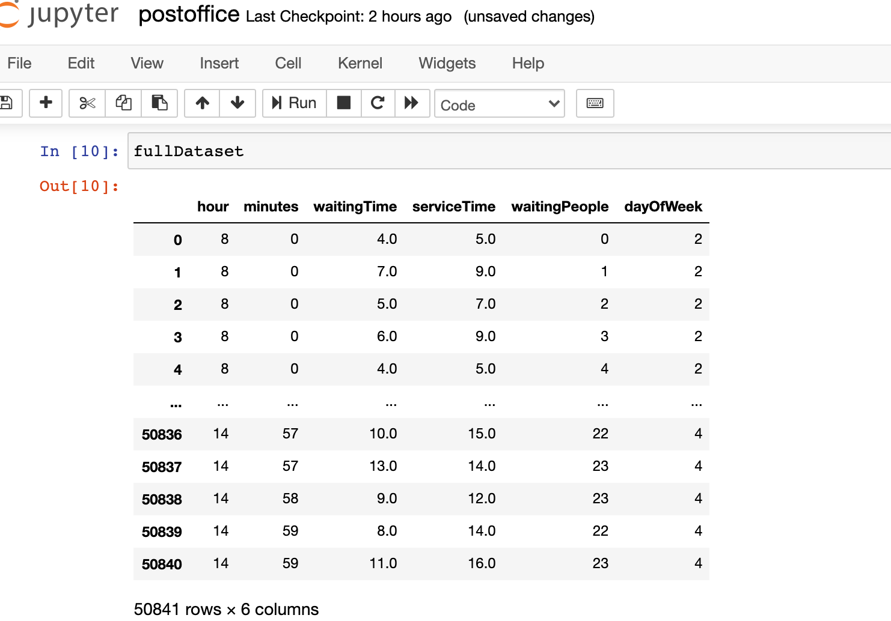

# Waiting-Time-Prediction

## Project Description

In this Project We have trained a 3-layered neural network and a Random forest model using a
publicly available dataset of queues in post offices.

1) Preprocessed the data and mean encoded it avoid errors
2) Trained Both the models to Predict values for future uses

## Results

Achieved a mean absolute error of **3.52 minutes** from the neural network 

Achieved a mean absolute error of **3.34 minutes** from the random forest model

## Data Representation

